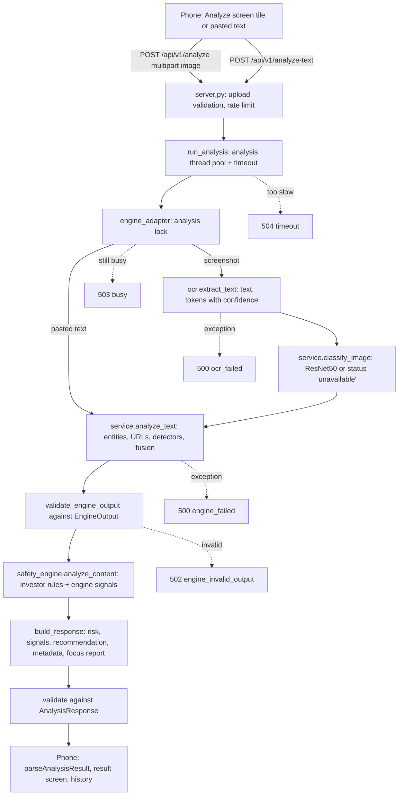

# Backend integration (Milestone 8)

How the mobile app reaches the detection engine (`phishing_detector`), what each side promises, how failures are reported, and what was tested. API version 1.4.0, contract version 1.1 (1.1 added the trained models; see [Contract 1.1](#contract-11-trained-models) and [model-integration.md](model-integration.md)).

## Execution flow



OCR is unchanged: the same `phishing_detector/ocr.py` pass feeds the engine, which extracts URLs from the OCR text itself.

### Files changed

| File | Change |
| --- | --- |
| `mobile server/contract.py` (new) | Pydantic models for the engine output and the mobile response |
| `mobile server/engine_adapter.py` (new) | OCR, classifier, engine, validation, merge, error types, model status |
| `mobile server/server.py` | Routes call the adapter; timeout, busy and error envelope; health reports engine status; warm-up |
| `mobile server/safety_engine.py` | Unified 0-100 score, level bands, recommendation, origin on signals, OCR line-wrap handling |
| `phishing_detector/service.py` | `classify_image` split out of `analyze_image` (behaviour unchanged) |
| `tests/test_backend_integration.py` (new) | Failure modes and integration tests |
| `mobile server/validation/` (new) | Labelled cases, runner, last report |
| `mobile/src/services/analysis-contract.ts` (new) | Runtime validation of responses |
| `mobile/src/services/api.ts` | New optional fields, 504 handling, validated parsing |
| `mobile/src/constants/risk.ts` | Score scale, reading-confidence copy, inconclusive handling |
| `mobile/src/app/result.tsx`, `components/sangyan/{risk-badge,result-parts,history-row}.tsx` | Show score out of the server's scale, confidence, recommendation, check details |

## Engine contract

> Proposed — needs sign-off from the engine owners (Sam / Aarav).

**Entry points** (`phishing_detector/service.py`):

- `analyze_text(text, tokens=None, settings=None, extra_detections=()) -> dict` — runs entity extraction, detectors and fusion on text. `tokens` are OCR tokens (text, confidence, character span) used to weight evidence by read quality.
- `classify_image(image, box=None, classify="full") -> (Detection, legacy)` — runs the ResNet50 classifier. Never raises for model problems; returns a detection with status `unavailable` and a reason instead.
- `analyze_image(src, box=None, langs=("en",), classify="full")` — unchanged one-call wrapper (OCR + classifier + `analyze_text`).

**Inputs.** OCR text (possibly empty), OCR tokens, and optional extra detections (the image classifier). URLs are not passed separately; the engine finds them in the text.

**Output** (validated by `EngineOutput`; extra fields ignored):

| Field | Type |
| --- | --- |
| `analysis_id` | string |
| `text` | string |
| `entities` | list of `{type, value, normalized, ...}` |
| `detected_urls` | list of strings |
| `detectors` | list of `{name, status, findings, detail, score}`; status is one of `ok`, `disabled`, `unavailable`, `not_configured`, `not_implemented` |
| `detectors[].findings` | `{category, score 0-1, title, description, evidence, hard_override}` |
| `risk` | `{level: dangerous / suspicious / low / unknown, score 0-100}` |
| `score_version` | string (currently `rules-v1+models-training-v1`) |
| `label`, `confidence` | image classifier label (`legitimate` / `phishing`) and 0-100, or null |

**Uncertainty.** The engine says `unknown` when it cannot judge; the adapter maps that (or fewer than 15 readable characters with no signals) to `INCONCLUSIVE`. Scores are uncalibrated and are not probabilities.

**Errors.** Model problems are reported as a detector status, not an exception. Any exception from OCR or `analyze_text`, or output that fails validation, fails the request; the adapter never substitutes a score.

## Adapter

`engine_adapter.analyze_screenshot(image, source, focus)` and `analyze_pasted_text(text, source, focus)`:

1. Read the screenshot (`extract_text(return_confidence=True)`).
2. Run the image classifier if its weights are available; otherwise record it as unavailable (or fail with 503 when `SANGYAN_REQUIRE_IMAGE_MODEL=1`).
3. Call `analyze_text` with the text, tokens and classifier detection.
4. Validate the engine output. Only the names of failing fields are logged.
5. Merge with the investor-safety rules. Engine findings keep their evidence and are tagged `origin: "engine"`; unknown finding titles are kept under a generated id rather than dropped.
6. Score = floor(max(rules score, engine score)). Bands: 70+ `HIGH_ATTENTION`, 40+ `ELEVATED`, 20+ `MODERATE`, otherwise `LOW_ATTENTION`. Every level above `LOW_ATTENTION` has at least one visible signal.
7. Validate the final response against `AnalysisResponse` before sending it.

`risk.confidence` is reading confidence (OCR confidence weighted by characters, or 1.0 for typed text). It is not the chance that something is a scam.

## Failure handling

Errors are returned as `{"detail": "<plain message>", "error": "<code>"}`. 503 and 504 include `Retry-After: 5`. Internal reasons only go to the server log.

| Situation | Result | Test |
| --- | --- | --- |
| Model loads | 200, `image_classifier: loaded`, visual signal when it says phishing | `test_model_loads_successfully` |
| Model missing | 200, degraded: listed in `/health`, startup warning and `metadata.unavailable_checks` | `test_model_missing_degrades_with_disclosure` |
| Model missing, `SANGYAN_REQUIRE_IMAGE_MODEL=1` | 503 `model_unavailable` | `test_model_missing_is_a_clear_error_when_required` |
| Model fails to load | 503 `model_unavailable`, status updated | `test_model_that_fails_to_load_is_reported` |
| Empty / unreadable OCR | 200, `status: inconclusive`, level `INCONCLUSIVE` | `test_unreadable_screenshots_are_inconclusive` |
| Invalid engine output | 502 `engine_invalid_output` | `test_invalid_engine_output_fails_validation`, `test_out_of_range_engine_scores_are_rejected` |
| Engine exception | 500 `engine_failed`, no internals in the reply | `test_inference_exception_is_controlled` |
| OCR exception | 500 `ocr_failed` | `test_ocr_exception_is_controlled` |
| Invalid image | 400 / 415 | `test_invalid_images_are_client_errors` |
| Timeout | 504 `timeout`; next request 503 `busy` while the stuck check finishes; then 200 | `test_timeout_is_recoverable` |

## Mobile compatibility

Changes the app needed for the new response:

- `risk.score` is now 0-100 with `risk.score_max: 100`. Old history entries have no `score_max` and keep their 0-10 scale.
- New level `INCONCLUSIVE` (old responses used `status: inconclusive` only).
- New optional fields: `risk.confidence`, `confidence_basis`, `engine_level`, `engine_score`, `signals[].origin`, `recommendation`, `metadata`, `detectors`.
- HTTP 504 maps to the app's "timeout" message; 500/502/503 show the existing server-error message.
- Responses are validated at runtime (`parseAnalysisResult`); a malformed reply shows "unexpected response" instead of crashing.

| Field | Where it shows |
| --- | --- |
| `risk.level` | Badge, colour and headline (`INCONCLUSIVE` uses the "unclear" copy, never the low copy) |
| `risk.score` / `score_max` | Badge "N/100" and the 10-segment meter |
| `risk.confidence` | "Reading confidence: X% · Clear / Mostly clear / Hard to read" or "Exact text", with a note that it is not a scam probability |
| `signals[]` | Signal cards with evidence; empty list shows "We didn't find any of the warning signs we check for", followed by advice to still verify before paying or investing |
| `explanation`, `verification` | Explanation text and verification steps |
| `recommendation.message` | Advice box (falls back to the app's own copy) |
| `metadata.processing_time_ms`, `engine_version`, `unavailable_checks` | "About this check" card |

Low results always say they are not proof that an investment is safe, both in the app copy and in the `LOW_ATTENTION` recommendation message.

## History

History stores the redacted result as returned (`analysis_id`, `analyzed_at`, risk level and score with its scale, signals, explanation, verification) plus the record's own timestamp. Old entries open with the 0-10 scale; delete and clear-all are unchanged. Nothing new is stored on the server.

## Validation set

`mobile server/validation/cases.json` has 16 labelled cases in 7 groups (legitimate, guaranteed returns, urgency, sensitive information, suspicious URL, mixed, unreadable). Expectations were written before running the engine. Each case is sent as pasted text and as a rendered screenshot through real OCR (unreadable cases as image only): 29 requests.

```powershell
cd "mobile server"
$env:SANGYAN_RATE_LIMIT = "1000"
python -m uvicorn server:app --port 8001      # separate terminal
python validation/run_validation.py http://127.0.0.1:8001 --report validation/last_run.json
```

**Results.** First run: 28/29. The screenshot of `mixed-withdrawal` came back `MODERATE` (expected at least `ELEVATED`) because OCR split "withdrawal / tax" across two lines and the rules did not match across a line break. That was a general bug, fixed in `safety_engine._matches` (also for words hyphenated at a line end) with a regression test that uses different wording. After the fix: 29/29. Because the fix was found with these cases, the 29/29 is not an independent result.

The set is a smoke test of the integration, not an accuracy measurement. Those runs used the rules and text path only. With the three trained models (contract 1.1) the result is 25/29: the legitimate SIP and AGM notices come back ELEVATED/MODERATE in both modes (see Known limitations); expectations were not edited.

**Latency** (laptop CPU, warm OCR, 16 screenshots): median about 3.1 s with the models, max 3.5 s. Pasted text: under 30 ms. The first request after start-up is slower if warm-up is disabled.

**Remaining OCR effects** (engine side, reported rather than patched):

- OCR read `https://` as `https:II`, so the domain became `iizerodha-allotment.top` and the brand mismatch was missed (still flagged as a suspicious link; 20 vs 54 for typed text).
- A link wrapped across lines and read as `http //bit.ly/stock-` lost the short-link finding (50 vs 70).

Screenshots generally score at or below the typed text for the same message.

## Contract 1.1 (trained models)

Version 1.1 only adds fields; 1.0 clients keep working.

| Field | Values | Meaning |
| --- | --- | --- |
| `analysis_status` | `COMPLETED`, `PARTIAL`, `INCONCLUSIVE` | `PARTIAL`: a trained model could not run, so the result is incomplete |
| `classification` | `likely_scam`, `suspicious`, `no_strong_indicators`, `undetermined` | Low + `PARTIAL` is `undetermined`, never "no indicators" |
| `risk.category` | `HIGH`, `MEDIUM`, `LOW`, `UNKNOWN` | HIGH_ATTENTION, ELEVATED or MODERATE, LOW_ATTENTION, INCONCLUSIVE |
| `detectors[].model_score`, `detectors[].tier` | 0-1, `high` / `medium` / `low` | Raw (uncalibrated) model output and its validated tier |

The illustrative response shape from the integration brief maps onto existing fields instead of duplicating them: `success` = HTTP 200 (errors use the `{detail, error}` envelope), `analysis_id`, `risk_level` = `risk.category`, `risk_score` = `risk.score`, `classification`, `findings` = `signals[]` (with evidence phrases and URLs), `recommendations` = `recommendation` + `verification`, `analysis_status`.

## Known limitations

- **Legitimate Indian financial notices.** The text model rates some genuine SIP/AGM notices MEDIUM (validation set 25/29; the 4 failures are these). Fix: retrain with labelled legitimate notices.
- **No external reputation.** Domain age, Safe Browsing and PhishTank / OpenPhish are `not_implemented`.
- **Uncalibrated scores.** Model tiers use thresholds chosen on validation data, but no score is a probability.
- **Small validation set,** synthetic screenshots in one font; real phone screenshots will differ.
- **One analysis at a time.** A stuck check makes later requests return `busy` until it finishes.
- **Contract not yet signed off** by the engine owners.

## Configuration

| Variable | Default | Effect |
| --- | --- | --- |
| `SANGYAN_ANALYSIS_TIMEOUT_S` | 75 | Seconds before a check returns 504 |
| `SANGYAN_LOCK_WAIT_S` | 20 | Seconds a request waits for the previous check before 503 |
| `SANGYAN_REQUIRE_IMAGE_MODEL` | 0 | 1 = fail screenshot checks when the image model is missing |
| `SANGYAN_WARMUP` | 1 | 0 = skip loading OCR at start-up |
| `SANGYAN_RATE_LIMIT` | 30 | POST requests per minute per IP |

## Tests

```powershell
cd src                     # inside the project folder, beside data, models and venv
python -m pytest tests -q
python "mobile server/security_check.py" http://127.0.0.1:8001 --log <server log>
```
